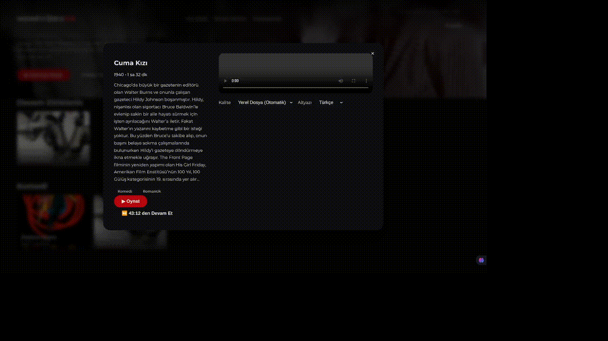

# homeVideoDB

Inspired by modern streaming platforms, this app is a lightweight hub that scans your local video archive and presents it with a dynamic interface. As soon as drone footage, wedding videos, or editing projects land in the media folder, they appear with posters, descriptions, and categories.

## Key Features

- 🎬 **Automatic library scan:** Video files inside `media/` are scanned on launch, missing entries are fetched through the TMDB API, and results are cached in `data/videos.json`.
- 🖼 **Poster and description matching:** When the title inferred from a filename matches on TMDB, poster, backdrop, genre, and runtime fields are populated automatically.
- ✋ **Manual metadata panel:** Unmatched videos surface as alerts at the top; fill out the form to update the JSON file without touching the command line.
- 🪄 **Dynamic hero section:** The large hero banner on the homepage rotates through your library every 3 seconds with smooth fades.
- 🎞️ **Card previews:** Hovering a poster plays the video silently from the 3-minute mark; these previews do not affect watch progress.
- ▶️ **Built-in player:** Videos open in a modal, quality options list themselves automatically, and posters double as backdrops.
- 💬 **Subtitle options:** `.srt/.vtt` files living next to the video are detected, exposed as language choices like Turkish/English, and can optionally be fetched via OpenSubtitles.
- 🔁 **Progress tracking:** Watch history lives in the browser so the "Continue Watching" row sends you back to where you left off.
- 💽 **Storage dashboard:** Track total/free disk space and homeVideoDB's footprint through a phone-style colorized progress bar.
- 🌐 **Torrent-powered online search:** Search torrents right from the UI for missing movies, pick a result, and follow the download in real time.

## Setup

1. Clone the repository or download it as a ZIP.
2. Install dependencies:
   ```bash
   npm install
   ```
3. Define your TMDB API key as an environment variable (you can obtain one with a free account at [themoviedb.org](https://www.themoviedb.org/)):
   ```bash
   export TMDB_API_KEY=YOUR_KEY_HERE
   ```
4. (Optional) Add an [OpenSubtitles](https://www.opensubtitles.com/) API key if you want automatic subtitle downloads:
   ```bash
   export OPENSUBTITLES_API_KEY=YOUR_KEY_HERE
   ```
   For requests that require download privileges you also need to provide a user token:
   ```bash
   export OPENSUBTITLES_USER_TOKEN=YOUR_USER_TOKEN
   ```
   (Optional) Set a custom User-Agent if you prefer:
   ```bash
   export OPENSUBTITLES_USER_AGENT="homeVideoDB/1.0"
   ```
   When both `OPENSUBTITLES_API_KEY` and `OPENSUBTITLES_USER_TOKEN` are present, missing Turkish/English subtitles are downloaded during the scan.
5. Copy your videos into the `media/` directory. Clean filenames such as `Eternal Sunshine of the Spotless Mind.mp4` increase the chance of a correct match.
6. Start the server:
   ```bash
   npm start
   ```
7. Visit [http://localhost:3000](http://localhost:3000) in your browser. The library scan runs automatically during startup.

> **Note:** If the API key is missing, files show up under "Missing Metadata Alerts". You can fill in the manual form to complete their details.

## How to Use

### Continue Watching

The app automatically remembers where you left off. Simply click on any movie you were watching to resume from your last position.



### Browse Your Library

View all your movies in a large grid layout with beautiful posters. Scroll through your entire collection at a glance.


### Video Previews

Hover over any movie poster to see a preview of the video. This helps you quickly find what you're looking for without opening the full player.


### Download Movies via Torrent

Search for movies that aren't in your library and download them directly through the integrated torrent system. The app will automatically add them to your collection once downloaded.


### Complete Workflow

Search for movies, download torrents, and watch them seamlessly. This demonstrates the full end-to-end experience of the app.


## Rescanning the Library

Whenever you add a new video, trigger a rescan with the "↻ Rescan" button at the top. To do the same from the command line:

```bash
npm run scan            # only new files
npm run scan -- --force # re-match every video
```

When the command finishes, unmatched videos are printed to the console and `data/videos.json` is updated.

## Downloading Missing Titles via Torrents

> Before you begin: make sure the `aria2c` command-line tool is installed on your system. You can install it with `sudo apt install aria2` on Linux, `brew install aria2` on macOS, or `winget install aria2.aria2` on Windows. Set a custom path through the `ARIA2_BINARY` environment variable if needed.

### Installing aria2c

**Ubuntu / Debian / Pop!_OS**
```bash
sudo apt update
sudo apt install aria2
```

**Fedora / CentOS / RHEL**
```bash
sudo dnf install aria2   # or sudo yum install aria2
```

**Arch / Manjaro**
```bash
sudo pacman -S aria2
```

**macOS (Homebrew)**
```bash
brew install aria2
```

**Windows (winget)**
```powershell
winget install aria2.aria2
```

After installation, run `aria2c --version` to ensure it is visible on your PATH. If you installed it elsewhere, set the variable below before starting the app:

```bash
export ARIA2_BINARY="/full/path/to/aria2c"
```

Use `ARIA2_RPC_PORT` to change the RPC port used in the background and `ARIA2_RPC_SECRET` to pin the randomly generated secret.

1. Type the movie title into the search bar. If nothing matches locally you will see the "⚡ Search online" button.
2. Click "⚡ Search online" or press `Enter`; the app lists torrent results from YTS and Apibay (Pirate Bay).
3. Pick the version you want and click **⬇ Download** to spawn the request through `aria2c`. Because it runs as a separate process, the download continues even if you close the tab.
4. The **Downloads** panel in the lower-right corner shows progress, current speed, ETA, and peer count. If the UI cannot launch (for example `aria2c` is missing) you will see a warning there.
5. Use **Pause**, **Resume**, and **Cancel** for each download. Cancelled jobs linger for a moment in the panel as "Cancelled".
6. When you reopen the app, unfinished downloads automatically resume where they left off.
7. Completed downloads land in `media/downloads/`, the library rescans itself, and the movie appears in the collections.

The storage usage card displays homeVideoDB's footprint, other files, and remaining free space on a single progress bar. If the free/used ratio or mount point changes, the label in the top-right corner refreshes automatically.

> **Tip:** Starting the same torrent twice returns a 409 error if the magnet link is already active. Clear finished items from the downloads panel or restart the `aria2c` process if you need a clean slate.

### Security Note

The only background dependency is `aria2c`, so the Node side stays clear of sensitive packages—`npm audit` reports zero issues. Tweak `ARIA2_RPC_PORT` and `ARIA2_RPC_SECRET` to fit your local security posture.

## Manual Metadata Workflow

1. Pick a video from the "Missing Metadata Alerts" list.
2. Fill in the title, description, poster, and tag fields in the form.
3. Hit "Save" to persist the data to `data/videos.json`, after which the video joins your collections.

For posters/backdrops you can point to any online image URL or drop custom artwork into `assets/posters/` and reference it via a relative path.

## How Subtitle Support Works

- `.srt` or `.vtt` files in the same folder as the video are detected and surfaced as options in the player.
- `.srt` files are converted to WebVTT on the fly to stay browser-compatible.
- When both `OPENSUBTITLES_API_KEY` and `OPENSUBTITLES_USER_TOKEN` are set, missing Turkish/English subtitles are downloaded from the OpenSubtitles API into the `media/` folder. The API key alone is not enough—you must also share your personal token.
- The player's subtitle choice is remembered per browser; the "Off" option is always available.

## Development Tips

- The layout is tuned for full-screen viewing; on smaller screens you can horizontally scroll the rows.
- Embedding the year in the filename (`(2004)` or `2004`) increases the matching accuracy.
- Once you finish a video, its stored progress is cleared automatically.

---

## ⚖️ Legal Notice and Liability Waiver (Important)

**homeVideoDB** does not host copyrighted content, offer hosting services, or distribute any media on its own. The app merely surfaces the user's local files and, if the user chooses, passes links from third-party torrent indexes (e.g., YTS, Apibay) to an external client (`aria2c`) to start the download on the user's device.

**You are responsible:** Ensuring the legal rights for any downloaded/streamed/distributed content is entirely up to the user. The developers and contributors cannot be held liable for direct or indirect damages arising from your usage.

### Acceptable use examples:

- Public domain works (where copyright has expired under your jurisdiction),
- Trailers/teasers and promotional videos officially released by the publisher,
- Open-licensed content (e.g., Creative Commons),
- Works whose license explicitly permits P2P acquisition.

### Prohibited/improper use examples:

Unauthorized full movie/series copies, pirated releases of in-theater titles, or any copies forbidden by a license agreement.

### Regional legislation:

Copyright and internet laws vary by country (e.g., FSEK in Türkiye, DMCA in the United States). This document is not legal advice—consult a legal professional about your situation before distribution.

### Acceptable Use Policy (AUP)

By using this project you agree to:

1. Download only the content you are legally authorized to use.
2. Limit torrent searches to public domain, open-licensed content, and official trailers.
3. Acknowledge that developers are not responsible for the content indexed by third-party services; you must validate the results yourself.
4. Accept full responsibility for any violations of applicable law.

> **Note:** Owning an old film on disc does not automatically permit torrent downloads. The correct measure is whether the license explicitly allows it or the work is legally in the public domain.

---

Enjoy the show! 🎉
